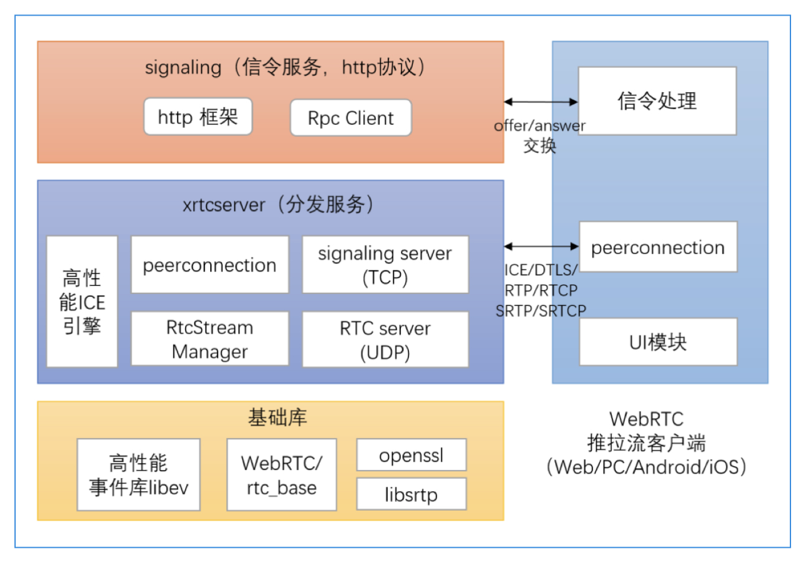

# WebRTC后台服务系统架构

## WebRTC推拉流客户端
主要实现Web端的音视频采集、WebRTC推拉流、音视频播放等功能。
## signaling(信令服务)
以http服务的方式，向WebRTC客户端提供offer/answer SDP的交换功能。
## xrtcserver(分发服务)
分发服务由两部分构成，一个是signaling模块，它是一个tcp server，负责处理信令服务转发过来的信令请求；一个是rtc模块，它是一个udp server，负责和WebRTC客户端建立peerconnection，实现音视频数据的分发。
## 基础库
libev：高性能事件库，事件驱动网络编程框架的核心WebRTC/rtc_base，移植于WebRTC的通用基础库，包含通用的字符串、时间、信号槽、日志等处理函数，openssl: 知名的安全库,libsrtp：rtp/rtcp加解密库。

